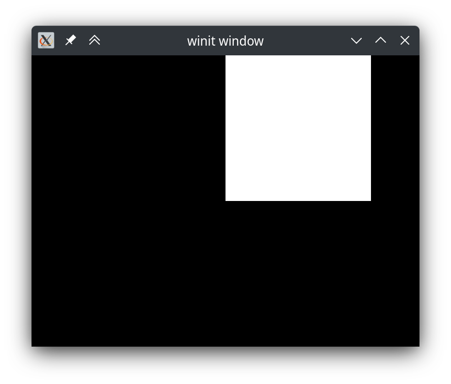

# Models

The next step is to load the models needed for the game. We do this in the `init` function. The first one you will store is a simple white rectangle, so let's add one at the default position:

```rust
use rhachis::{
    // Add needed uses
    renderers::{SimpleProjection, SimpleRenderer, Model, Transform},
    *,
};

// ...

    fn init(data: &GameData) -> Self {
        // Made this mutable
        let mut renderer = SimpleRenderer::new(
            data,
            SimpleRenderer::center_height(data.get_window_size().as_vec2(), 2.0),
        );

        // New
        renderer.models.push(Model::quad(data, vec![Transform::default()]));

        Self { renderer }
    }

// ...
```

If we run this, we'll see your first rendered model in Rhachis!



Let's break down that line we just added:

```rust
renderer.models.push(				// 1.
    Model::quad(					// 2.
        data,						// 3.
        vec![Transform::default()]	// 4.
    )
);
```

1. Models are only rendered if they are pushed to the renderer's `models` [IdMap](https://docs.rs/rhachis/latest/rhachis/struct.IdMap.html). This is why we had to make `renderer` mutable.
2. [Model::quad](https://docs.rs/rhachis/latest/rhachis/renderers/struct.Model.html#method.quad) is a convenience function for making a `Model` that is a simple white quad. It's useful for prototyping and testing.
3. As with most functions in Rhachis, the [GameData](https://docs.rs/rhachis/latest/rhachis/struct.GameData.html) `struct` is passed to the function to give access to internal engine components.
4. When models are created, they must be given a list of transforms. A transform is a change to the model, like moving/translating it or rotating it. In this case since we're just trying to add the model without positioning it, we can give it a single `Transform` with the default value.
